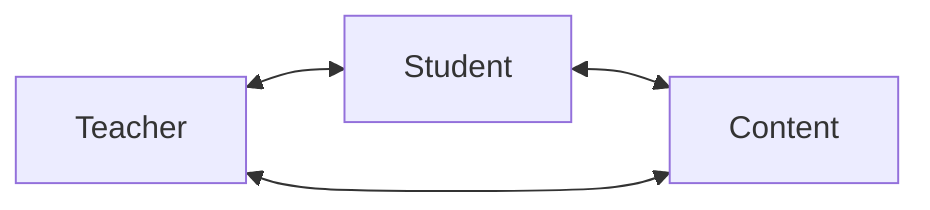

# Instructional Core

## Seven Principals

2026

<!-- Slide 1 -->

---
layout: center
---

# The Instructional Core:

---
Layout: image-left
image: /image.png
---

# Principle 1

## Increases in student learning occur only as a consequence of improvements in:

   <v-clicks>
     
   - Level of Content
   - Teacher's Knowledge
   - Student Engagement
   - 
   </v-clicks>
  
   [^1]: City et al., ** Instructional Rounds in Education **

---

layout: end
---

